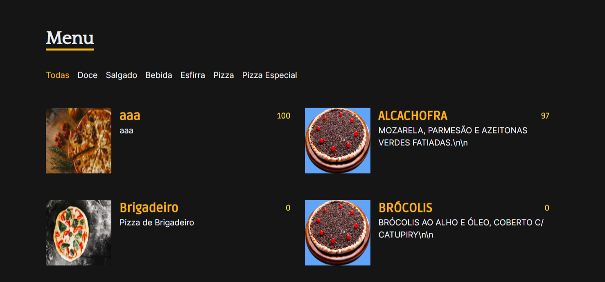
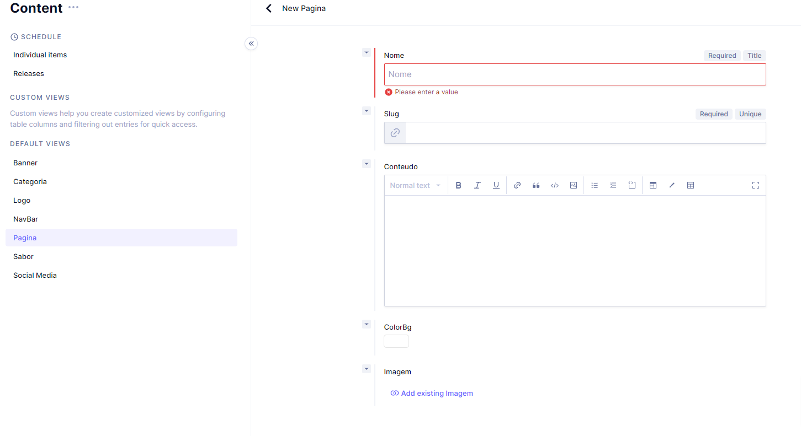
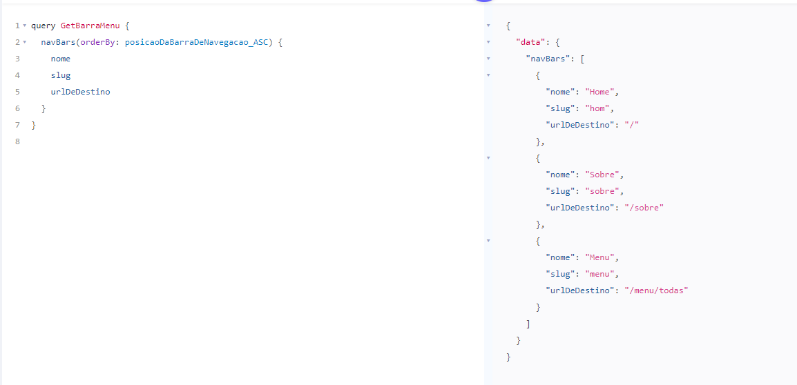
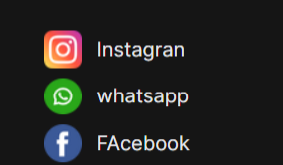
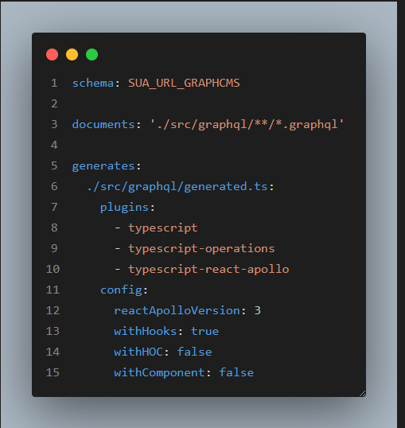

# pizzaria_web_site_graphcms
**## Resumo e descrição do projeto**

<p>Site dinâmico no tema de pizzaria. Gerenciado totalmente pelo CMS, onde temos:</p>
<p>Uma tabela de cadastro de categoria dinâmicas e produtos, onde uma categoria para lista todos os produtos cadastrados e as demais são filtradas </p>


<p>Temos um gerenciador de páginas dinâmicas, onde pode ser criar o texto e formatado pelo CMS</p>



<p>A listagem da barra de menu é  gerenciada pelo GraphCMS</p>


<p>A listagem de links sociais ou links de terceiros</p>



****Tecnologias****

Este projeto foi feito utilizando as seguintes tecnologias:

- [React](https://reactjs.org/)
- [Typescript](https://www.typescriptlang.org/)
- [GraphCMS](https://app.graphcms.com/)
- [Graphql](https://graphql.org/)
- [Apollo](https://www.apollographql.com/)

### Link do projeto graphcms
https://app.graphcms.com/clone/21874e8032c34d629534c29390162d04?name=pizzaria_dinamica
**### Tutorial de instalação**

Clone o projeto

```term

git@github.com:moraes3000/pizzaria_web_site_graphcms.git
```

Instale as dependências

```term

yarn

```

Rode o projeto

```term

yarn dev

```

Clone o projeto GraphCMS, pela seguinte URL
 - https://app.graphcms.com/clone/21874e8032c34d629534c29390162d04?name=pizzaria_dinamica

<p>Substitua a url do arquivo codegem.yml</p>


Rode o codegem
``` term
yarn codegen

```
Rode o projeto
``` term
yarn dev

```

Vai estar disponível no seguinte endereço:
http://localhost:3000/